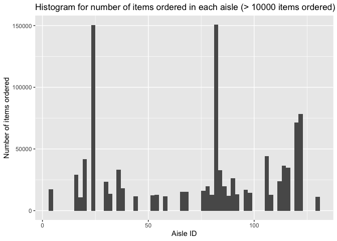

HW 3
================
Shihui Zhu sz3029

``` r
# This chunk loads all the packages used in this homework
library(tidyverse)
```

# Problem 1

## Load instacart dataset

``` r
library(p8105.datasets)
data("instacart")
```

## Description of the dataset

The instacart dataset contains 1384617 observations of 15 variables. The
variables are:
`order_id, product_id, add_to_cart_order, reordered, user_id, eval_set, order_number, order_dow, order_hour_of_day, days_since_prior_order, product_name, aisle_id, department_id, aisle, department`.
Some key variables are:

-   `order_id`: order identifier, contains 131209 individual orders

-   `product_id`: product identifier, contains 39123 individual products

-   `reordered`: 1 if the product has been ordered by this user in the
    past, 0 otherwise

-   `user_id`: customer identifier, contains 131209 individual customers

-   `order_number`: the order sequence number for this user

-   `order_dow`: the day of the week on which the order was placed

-   `aisle_id`: aisle identifier, contains 134 aisles

-   `department_id`: department identifier, contains 21 departments

| order\_id | product\_id | add\_to\_cart\_order | reordered | user\_id | eval\_set | order\_number | order\_dow | order\_hour\_of\_day | days\_since\_prior\_order | product\_name    | aisle\_id | department\_id | aisle  | department |
|----------:|------------:|---------------------:|----------:|---------:|:----------|--------------:|-----------:|---------------------:|--------------------------:|:-----------------|----------:|---------------:|:-------|:-----------|
|         1 |       49302 |                    1 |         1 |   112108 | train     |             4 |          4 |                   10 |                         9 | Bulgarian Yogurt |       120 |             16 | yogurt | dairy eggs |

An example of the above observation in the dataset: A customer with id
112108 ordered “Bulgarian Yogurt” (product id 49302) from department
“dairy eggs,” aisle “yogurt”. This was his/her 4th order at instacart,
and the product was a re-ordered product for him/her, as well as the
first order added to cart. The order was placed at Thursday 10am, and it
was 9 days after his/her last order.

## Questions

-   How many aisles are there, and which aisles are the most items
    ordered from?

``` r
length(unique(dplyr::pull(instacart, aisle_id)))
```

    ## [1] 134

There are 134 aisles.

``` r
mode_aisle <- function(v) {
   uniq <- unique(v)
   uniq[which.max(tabulate(match(v, uniq)))]
}
mode_aisle((dplyr::pull(instacart, aisle_id)))
```

    ## [1] 83

The aisle with id 83, “fresh vegetables,” is which the most items
ordered from.

-   Make a plot that shows the number of items ordered in each aisle,
    limiting this to aisles with more than 10000 items ordered. Arrange
    aisles sensibly, and organize your plot so others can read it.

``` r
instacart %>%
  group_by(aisle_id) %>%
  filter(n() > 10000) %>%
  arrange(aisle_id) %>%
  ggplot(aes(x = aisle_id)) +
  geom_histogram(binwidth = 2) +
  labs(
    title = "Histogram for number of items ordered in each aisle (> 10000 items ordered)",
    x = "Aisle ID",
    y = "Number of items ordered")
```

<!-- -->

Make a table showing the three most popular items in each of the aisles
“baking ingredients”, “dog food care”, and “packaged vegetables fruits”.
Include the number of times each item is ordered in your table.

``` r
instacart %>%
  filter(
    aisle %in% c("baking ingredients", "dog food care", "packaged vegetables fruits")
  ) %>%
  group_by(aisle, product_name) %>%
  summarise(count = n()) %>%
  mutate(rank =  dense_rank(desc(count))) %>%
  filter(rank < 4) %>% 
  arrange(aisle, rank) %>%
  knitr::kable(col.names = c("Aisle", "Product Name", "Count", "Rank"))
```

    ## `summarise()` has grouped output by 'aisle'. You can override using the `.groups` argument.

| Aisle                      | Product Name                                  | Count | Rank |
|:---------------------------|:----------------------------------------------|------:|-----:|
| baking ingredients         | Light Brown Sugar                             |   499 |    1 |
| baking ingredients         | Pure Baking Soda                              |   387 |    2 |
| baking ingredients         | Cane Sugar                                    |   336 |    3 |
| dog food care              | Snack Sticks Chicken & Rice Recipe Dog Treats |    30 |    1 |
| dog food care              | Organix Chicken & Brown Rice Recipe           |    28 |    2 |
| dog food care              | Small Dog Biscuits                            |    26 |    3 |
| packaged vegetables fruits | Organic Baby Spinach                          |  9784 |    1 |
| packaged vegetables fruits | Organic Raspberries                           |  5546 |    2 |
| packaged vegetables fruits | Organic Blueberries                           |  4966 |    3 |
