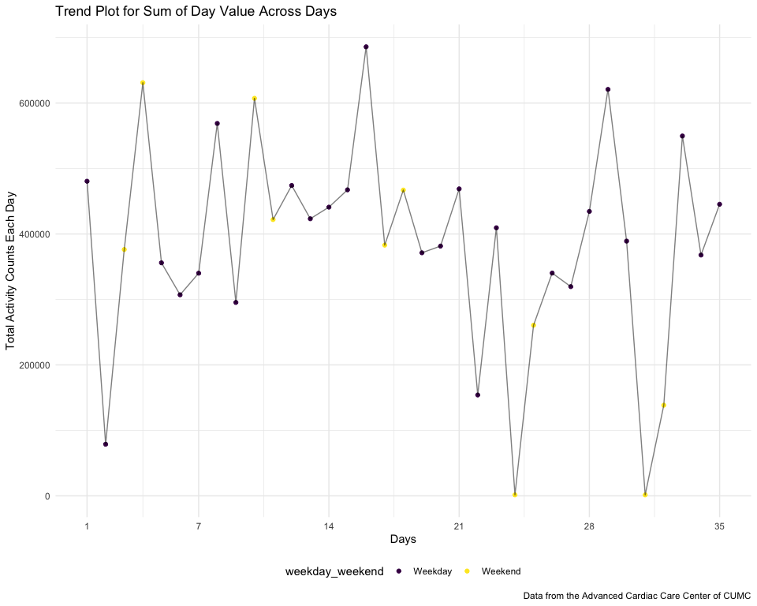

HW 3
================
Shihui Zhu sz3029

# Problem 1

## Load instacart dataset

``` r
data("instacart")

instacart
```

    ## # A tibble: 1,384,617 × 15
    ##    order_id product_id add_to_cart_order reordered user_id eval_set order_number
    ##       <int>      <int>             <int>     <int>   <int> <chr>           <int>
    ##  1        1      49302                 1         1  112108 train               4
    ##  2        1      11109                 2         1  112108 train               4
    ##  3        1      10246                 3         0  112108 train               4
    ##  4        1      49683                 4         0  112108 train               4
    ##  5        1      43633                 5         1  112108 train               4
    ##  6        1      13176                 6         0  112108 train               4
    ##  7        1      47209                 7         0  112108 train               4
    ##  8        1      22035                 8         1  112108 train               4
    ##  9       36      39612                 1         0   79431 train              23
    ## 10       36      19660                 2         1   79431 train              23
    ## # … with 1,384,607 more rows, and 8 more variables: order_dow <int>,
    ## #   order_hour_of_day <int>, days_since_prior_order <int>, product_name <chr>,
    ## #   aisle_id <int>, department_id <int>, aisle <chr>, department <chr>

## Description of the dataset

The instacart dataset contains 1384617 observations of 15 variables. The
variables are: order_id, product_id, add_to_cart_order, reordered,
user_id, eval_set, order_number, order_dow, order_hour_of_day,
days_since_prior_order, product_name, aisle_id, department_id, aisle,
department, described below:

-   `order_id`: order identifier, contains 131209 individual orders

-   `product_id`: product identifier, contains 39123 individual products

-   `add_to_cart_order`: order in which each product was added to cart

-   `reordered`: 1 if the product has been ordered by this user in the
    past, 0 otherwise

-   `user_id`: customer identifier, contains 131209 individual customers

-   eval_set\`: which evaluation set this order belongs in *(Note that
    the data for use in this class is exclusively from the “train”
    eval_set)*

-   `order_number`: the order sequence number for this user

-   `order_dow`: the day of the week on which the order was placed

-   `order_hour_of_day`: the hour of the day on which the order was
    placed

-   days_since_prior_order\`: days since the last order, capped at 30,
    NA if order_number=1

-   `product_name`: name of the product

-   `aisle_id`: aisle identifier, contains 134 aisles

-   `department_id`: department identifier, contains 21 departments

-   `aisle`: name of the aisle

-   `department`: name of the department

An example of an observation in the dataset:

| order_id | product_id | add_to_cart_order | reordered | user_id | eval_set | order_number | order_dow | order_hour_of_day | days_since_prior_order | product_name     | aisle_id | department_id | aisle  | department |
|---------:|-----------:|------------------:|----------:|--------:|:---------|-------------:|----------:|------------------:|-----------------------:|:-----------------|---------:|--------------:|:-------|:-----------|
|        1 |      49302 |                 1 |         1 |  112108 | train    |            4 |         4 |                10 |                      9 | Bulgarian Yogurt |      120 |            16 | yogurt | dairy eggs |

A customer with id 112108 ordered “Bulgarian Yogurt” (product id 49302)
from department “dairy eggs,” aisle “yogurt”. This was his/her 4th order
at instacart, and the product was a re-ordered product for him/her, as
well as the first order added to cart. The order was placed at Thursday
10am, and it was 9 days after his/her last order.

## Answers to Questions

1.  How many aisles are there, and which aisles are the most items
    ordered from?

``` r
length(unique(dplyr::pull(instacart, aisle_id)))
## [1] 134
```

There are 134 aisles.

``` r
instacart %>%
  group_by(aisle_id, aisle) %>%
  summarise(count = n()) %>%
  arrange(desc(count))
## `summarise()` has grouped output by 'aisle_id'. You can override using the `.groups` argument.
## # A tibble: 134 × 3
## # Groups:   aisle_id [134]
##    aisle_id aisle                          count
##       <int> <chr>                          <int>
##  1       83 fresh vegetables              150609
##  2       24 fresh fruits                  150473
##  3      123 packaged vegetables fruits     78493
##  4      120 yogurt                         55240
##  5       21 packaged cheese                41699
##  6      115 water seltzer sparkling water  36617
##  7       84 milk                           32644
##  8      107 chips pretzels                 31269
##  9       91 soy lactosefree                26240
## 10      112 bread                          23635
## # … with 124 more rows
```

The aisle with id 83 (“fresh vegetables”) is which the most items
ordered from, and it is ordered 150609 times.

2.  Make a plot that shows the number of items ordered in each aisle,
    limiting this to aisles with more than 10000 items ordered. Arrange
    aisles sensibly, and organize your plot so others can read it.

``` r
instacart %>%
  group_by(aisle) %>%
  summarise(aisle_count = n()) %>%
  # limiting this to aisles with more than 10000 items ordered
  filter(aisle_count > 10000) %>%
  # arrange from lowest to highest
  arrange(aisle_count) %>%
  # preserve the order
  mutate(aisle = factor(aisle, levels = aisle)) %>%
  ggplot(aes(y = aisle, x = aisle_count, fill = aisle)) +
  # Use bar graph
  geom_col() +
  labs(
    title = "Number of items ordered in each aisle (> 10000 items ordered)",
    x = "Number of items ordered",
    y = "Aisle",
    caption = "Data from Instacart Dataset"
  )
```


3.  Make a table showing the three most popular items in each of the
    aisles “baking ingredients”, “dog food care”, and “packaged
    vegetables fruits”. Include the number of times each item is ordered
    in your table.

``` r
instacart %>%
  # limit to only the three aisles
  filter(
    aisle %in% c("baking ingredients", "dog food care", "packaged vegetables fruits")
  ) %>%
  group_by(aisle, product_name) %>%
  summarise(count = n()) %>%
  mutate(rank =  dense_rank(desc(count))) %>%
  # limit to top three popular items
  filter(rank < 4) %>% 
  arrange(aisle, rank) %>%
  # make it more readable
  pivot_wider(
    names_from = rank,
    values_from = c(product_name, count)) %>%
  knitr::kable(col.names = c("aisle", "product_rank_1", "product_rank_2", "product_rank_3",
                             "product_rank_1_count", "product_rank_2_count", "product_rank_3_count"))
```

| aisle                      | product_rank_1                                | product_rank_2                      | product_rank_3      | product_rank_1\_count | product_rank_2\_count | product_rank_3\_count |
|:---------------------------|:----------------------------------------------|:------------------------------------|:--------------------|----------------------:|----------------------:|----------------------:|
| baking ingredients         | Light Brown Sugar                             | Pure Baking Soda                    | Cane Sugar          |                   499 |                   387 |                   336 |
| dog food care              | Snack Sticks Chicken & Rice Recipe Dog Treats | Organix Chicken & Brown Rice Recipe | Small Dog Biscuits  |                    30 |                    28 |                    26 |
| packaged vegetables fruits | Organic Baby Spinach                          | Organic Raspberries                 | Organic Blueberries |                  9784 |                  5546 |                  4966 |

4.  Make a table showing the mean hour of the day at which Pink Lady
    Apples and Coffee Ice Cream are ordered on each day of the week;
    format this table for human readers

``` r
instacart %>%
  filter(
    product_name %in% c("Pink Lady Apples", "Coffee Ice Cream")
  ) %>%
  # change day value into human readable format
  mutate(order_dow = lubridate::wday(order_dow + 1, label = TRUE)) %>%
  group_by(product_name, order_dow) %>%
  # change the table format to long
  summarise(mean = mean(order_hour_of_day), .groups = "drop") %>%
  spread(order_dow, mean) %>%
  # add caption and col names
  knitr::kable(digits = 1, 
               col.names = c("Product", "Sunday", "Monday", "Tuesday", "Wednesday", "Thursday", "Friday", "Saturday"),
               caption = "The mean hour of the day at which Pink Lady Apples and Coffee Ice Cream are ordered on each day of the week")
```

| Product          | Sunday | Monday | Tuesday | Wednesday | Thursday | Friday | Saturday |
|:-----------------|-------:|-------:|--------:|----------:|---------:|-------:|---------:|
| Coffee Ice Cream |   13.8 |   14.3 |    15.4 |      15.3 |     15.2 |   12.3 |     13.8 |
| Pink Lady Apples |   13.4 |   11.4 |    11.7 |      14.2 |     11.6 |   12.8 |     11.9 |

The mean hour of the day at which Pink Lady Apples and Coffee Ice Cream
are ordered on each day of the week

# Problem 2

## Load BRFSS dataset

``` r
# load from p8105.dataset
data("brfss_smart2010")

# create the cleaned data frame
brfss_smart2010 <- 
  brfss_smart2010 %>% 
  janitor::clean_names() %>%
  # rename variables
  rename("location" = locationdesc, 
         "resp_id" = respid) %>%
  separate(location, into = c("state", "location"), sep = " - ") %>%
  select(-locationabbr) %>%
  # focus on the “Overall Health” topic
  filter(topic == "Overall Health") %>% 
  # include only responses from “Excellent” to “Poor”
  filter(
    response %in% c("Excellent", "Poor", "Very good", "Good", "Fair")
    ) %>%
  mutate(
    response = factor(response, 
                      levels = c("Poor", "Fair", "Good", "Very good", "Excellent"), 
                      ordered = TRUE)) %>%
  # organize responses as a factor taking levels ordered from “Poor” to “Excellent”
  arrange(response)

brfss_smart2010
```

    ## # A tibble: 10,625 × 23
    ##     year state location  class  topic  question  response sample_size data_value
    ##    <int> <chr> <chr>     <chr>  <chr>  <chr>     <ord>          <int>      <dbl>
    ##  1  2010 AL    Jefferso… Healt… Overa… How is y… Poor              45        5.5
    ##  2  2010 AL    Mobile C… Healt… Overa… How is y… Poor              66        6.4
    ##  3  2010 AL    Tuscaloo… Healt… Overa… How is y… Poor              35        4.2
    ##  4  2010 AZ    Maricopa… Healt… Overa… How is y… Poor              62        3.5
    ##  5  2010 AZ    Pima Cou… Healt… Overa… How is y… Poor              49        5.7
    ##  6  2010 AZ    Pinal Co… Healt… Overa… How is y… Poor              30        4  
    ##  7  2010 AR    Benton C… Healt… Overa… How is y… Poor              21        3  
    ##  8  2010 AR    Pulaski … Healt… Overa… How is y… Poor              36        3.8
    ##  9  2010 AR    Washingt… Healt… Overa… How is y… Poor              16        2.4
    ## 10  2010 CA    Alameda … Healt… Overa… How is y… Poor              23        2.4
    ## # … with 10,615 more rows, and 14 more variables: confidence_limit_low <dbl>,
    ## #   confidence_limit_high <dbl>, display_order <int>, data_value_unit <chr>,
    ## #   data_value_type <chr>, data_value_footnote_symbol <chr>,
    ## #   data_value_footnote <chr>, data_source <chr>, class_id <chr>,
    ## #   topic_id <chr>, location_id <chr>, question_id <chr>, resp_id <chr>,
    ## #   geo_location <chr>

1.  In 2002, which states were observed at 7 or more locations?

``` r
more_than_7_2002 <-
  brfss_smart2010 %>%
  filter(year == "2002") %>%
  group_by(state) %>%
  summarize(count_location = n()) %>%
  filter(count_location >= 7)
```

There are 36 states:

AZ, CO, CT, DE, FL, GA, HI, ID, IL, IN, KS, LA, MA, MD, ME, MI, MN, MO,
NC, NE, NH, NJ, NV, NY, OH, OK, OR, PA, RI, SC, SD, TN, TX, UT, VT, WA

What about in 2010?

``` r
more_than_7_2010 <-
  brfss_smart2010 %>%
  filter(year == "2010") %>%
  group_by(state) %>%
  summarize(count_location = n()) %>%
  filter(count_location >= 7)
```

There are 45 states:

AL, AR, AZ, CA, CO, CT, DE, FL, GA, HI, IA, ID, IL, IN, KS, LA, MA, MD,
ME, MI, MN, MO, MS, MT, NC, ND, NE, NH, NJ, NM, NV, NY, OH, OK, OR, PA,
RI, SC, SD, TN, TX, UT, VT, WA, WY

2.  Construct a dataset that is limited to Excellent responses, and
    contains, year, state, and a variable that averages the data_value
    across locations within a state. Make a “spaghetti” plot of this
    average value over time within a state

``` r
brfss_smart2010_spaghetti <-
  brfss_smart2010 %>%
  filter(response == "Excellent") %>%
  group_by(year, state) %>%
  summarise(mean_data_value = mean(data_value))

brfss_smart2010_spaghetti
```

    ## # A tibble: 443 × 3
    ## # Groups:   year [9]
    ##     year state mean_data_value
    ##    <int> <chr>           <dbl>
    ##  1  2002 AK               27.9
    ##  2  2002 AL               18.5
    ##  3  2002 AR               24.1
    ##  4  2002 AZ               24.1
    ##  5  2002 CA               22.7
    ##  6  2002 CO               23.1
    ##  7  2002 CT               29.1
    ##  8  2002 DC               29.3
    ##  9  2002 DE               20.9
    ## 10  2002 FL               25.7
    ## # … with 433 more rows

Plot:

``` r
brfss_smart2010_spaghetti %>%
  ggplot(aes(x = year, y = mean_data_value)) +
  geom_line(aes(color = state)) +
  labs(
    title = "Spaghetti Plot for Mean Data Value over Time",
    x = "Year",
    y = " Mean Data Value across Locations within a State",
    caption = "Data from the BRFSS SMART dataset"
  )
```


-   Make a two-panel plot showing, for the years 2006, and 2010,
    distribution of data_value for responses (“Poor” to “Excellent”)
    among locations in NY State.

``` r
brfss_smart2010 %>%
  # select 2006, 2010 years only, NY only
  filter(year %in% c("2006", "2010"),
         state == "NY") %>%
  # group by responses
  group_by(response) %>%
  ggplot(aes(x = data_value, fill = response)) +
  geom_density(alpha = .4, adjust = .5, color = "blue") +
  labs(
    title = "Two-Panel Plot for Responses in NY State in 2002 and 2010 Year",
    x = "Data Value",
    y = "Density",
    caption = "Data from the BRFSS SMART dataset"
  ) +
  facet_grid(. ~ year)
```


# Problem 3

## Load and tidy data

-   include all originally observed variables and values
-   have useful variable names
-   include a weekday vs weekend variable
-   encode data with reasonable variable classes

``` r
# create the data frame
df_accel <- 
  #read data from csv file
  read_csv('./accel_data.csv') %>%
  #clean columns names
  janitor::clean_names() %>%
  # add a weekday v.s. weekend column
  mutate(
    weekday_weekend = ifelse(day %in% c("Monday", "Tuesday", "Wednesday", "Thursday", "Friday"), "Weekday", "Weekend"),
    day = factor(day, 
    levels = c("Sunday", "Monday", "Tuesday", "Wednesday", "Thursday", "Friday", "Saturday"))
  ) %>% 
  select(week, day_id, day, weekday_weekend, everything()) %>%
  # encode activity_k into numeric values
  pivot_longer(
    cols = activity_1:activity_1440,
    names_prefix = "activity_",
    values_to = "activity_counts",
    names_to = "minute_order"
  ) %>% 
  mutate(minute_order = as.numeric(minute_order))

df_accel
```

    ## # A tibble: 50,400 × 6
    ##     week day_id day    weekday_weekend minute_order activity_counts
    ##    <dbl>  <dbl> <fct>  <chr>                  <dbl>           <dbl>
    ##  1     1      1 Friday Weekday                    1            88.4
    ##  2     1      1 Friday Weekday                    2            82.2
    ##  3     1      1 Friday Weekday                    3            64.4
    ##  4     1      1 Friday Weekday                    4            70.0
    ##  5     1      1 Friday Weekday                    5            75.0
    ##  6     1      1 Friday Weekday                    6            66.3
    ##  7     1      1 Friday Weekday                    7            53.8
    ##  8     1      1 Friday Weekday                    8            47.8
    ##  9     1      1 Friday Weekday                    9            55.5
    ## 10     1      1 Friday Weekday                   10            43.0
    ## # … with 50,390 more rows

## Description

The accelerometer data contains 50400 observations of 6 variables. The
variables are
`week, day_id, day, weekday_weekend, minute_order, activity_counts`:

-   `week`: week number, total of 5 weeks

-   `day_id`: day number, total of 35 days

-   `day`: at which day of that week

-   `weekday_weekend`: weekday or weekend

-   `minute_order`: at which minute of that day

-   `activity_counts`: activity counts

## Analysis focus on the total activity over the day

``` r
df_accel_day <- 
  df_accel %>% 
  group_by(week, day) %>% 
  #  aggregate across minutes to create a total activity each day
  mutate(total_counts_in_a_day = sum(activity_counts)) %>% 
  select(-activity_counts, -minute_order) %>% 
  # Remove redundant lines
  distinct() %>% 
  arrange(week, day)
```

Create a table for total activity over the day

| week | day_id | day       | weekday_weekend | total_counts_in_a\_day |
|-----:|-------:|:----------|:----------------|-----------------------:|
|    1 |      4 | Sunday    | Weekend         |              631105.00 |
|    1 |      2 | Monday    | Weekday         |               78828.07 |
|    1 |      6 | Tuesday   | Weekday         |              307094.24 |
|    1 |      7 | Wednesday | Weekday         |              340115.01 |
|    1 |      5 | Thursday  | Weekday         |              355923.64 |
|    1 |      1 | Friday    | Weekday         |              480542.62 |
|    1 |      3 | Saturday  | Weekend         |              376254.00 |
|    2 |     11 | Sunday    | Weekend         |              422018.00 |
|    2 |      9 | Monday    | Weekday         |              295431.00 |
|    2 |     13 | Tuesday   | Weekday         |              423245.00 |
|    2 |     14 | Wednesday | Weekday         |              440962.00 |
|    2 |     12 | Thursday  | Weekday         |              474048.00 |
|    2 |      8 | Friday    | Weekday         |              568839.00 |
|    2 |     10 | Saturday  | Weekend         |              607175.00 |
|    3 |     18 | Sunday    | Weekend         |              467052.00 |
|    3 |     16 | Monday    | Weekday         |              685910.00 |
|    3 |     20 | Tuesday   | Weekday         |              381507.00 |
|    3 |     21 | Wednesday | Weekday         |              468869.00 |
|    3 |     19 | Thursday  | Weekday         |              371230.00 |
|    3 |     15 | Friday    | Weekday         |              467420.00 |
|    3 |     17 | Saturday  | Weekend         |              382928.00 |
|    4 |     25 | Sunday    | Weekend         |              260617.00 |
|    4 |     23 | Monday    | Weekday         |              409450.00 |
|    4 |     27 | Tuesday   | Weekday         |              319568.00 |
|    4 |     28 | Wednesday | Weekday         |              434460.00 |
|    4 |     26 | Thursday  | Weekday         |              340291.00 |
|    4 |     22 | Friday    | Weekday         |              154049.00 |
|    4 |     24 | Saturday  | Weekend         |                1440.00 |
|    5 |     32 | Sunday    | Weekend         |              138421.00 |
|    5 |     30 | Monday    | Weekday         |              389080.00 |
|    5 |     34 | Tuesday   | Weekday         |              367824.00 |
|    5 |     35 | Wednesday | Weekday         |              445366.00 |
|    5 |     33 | Thursday  | Weekday         |              549658.00 |
|    5 |     29 | Friday    | Weekday         |              620860.00 |
|    5 |     31 | Saturday  | Weekend         |                1440.00 |

Total activity over the day

``` r
df_accel_day %>% 
  ggplot(aes(x = day_id, y = total_counts_in_a_day)) +
  # create a scatterplot
  geom_point(aes(color = weekday_weekend)) +
  # add in the trend line
  geom_line(alpha = 0.5) +
  # add title, labels for x- and y- axis and caption
  labs(
    title = "Trend Plot for Sum of Day Value Across Days",
    x = "Days",
    y = "Total Activity Counts Each Day",
    caption = "Data from the Advanced Cardiac Care Center of CUMC"
  ) +
  scale_x_continuous(
    # make the x-axis 1-35
    breaks = c(1, 7, 14, 21, 28, 35),
    labels = c('1', '7', '14', '21', '28', '35')
  ) +
  scale_y_continuous(
    # make the x-axis 1-35
    breaks = c(0, 200000, 400000, 600000),
    labels = c('0', '200000', '400000', '600000')
  )
```



The trend plot shows that the total activity counts on weekend decreased
over time, whereas the the total activity counts on weekday had no
significant change over time.

## Activity over the course of the day

-   Make a single-panel plot that shows the 24-hour activity time
    courses for each day and use color to indicate day of the week

``` r
df_accel %>% 
  group_by(day_id) %>% 
  # convert minutes to hours
  mutate(hour_order = ceiling(minute_order / 60)) %>% 
  # group by hour and day
  group_by(day_id, day, hour_order) %>% 
  # Find the total activity for each hour
  summarize(counts_by_hour = sum(activity_counts)) %>%
  # hour v.s. hour counts, colored by day of the week
  ggplot(aes(x = hour_order, y = counts_by_hour, color = day)) +
  geom_point() +
  geom_line() +
  labs(
    title = "Plot for 24-hour Activity Time Courses for Each Day",
    x = "Hour Order",
    y = "Total Activity Counts",
    caption = "Data from the Advanced Cardiac Care Center of Columbia University Medical Center") +
  scale_x_continuous(
    # make the x-axis between 0-24
    breaks = c(0, 4, 8, 12, 16, 20, 24),
    labels = c("0", "4", "8", "12", "16", "20", "24"))
```


The total activity counts increased by hour during a 24-hour period for
Friday, Saturday and Monday, and the highest was around 10pm and 12am.
However, for Wednesday and Sunday, the hours with highest total activity
counts is at the first half of the day, 7am to 11am. For Tuesday and
Thursday, there is no significant trend. The activity counts from 12am
to 5am were mostly not zero, indicating that the participant was not
always asleep during the regular bedtime.
